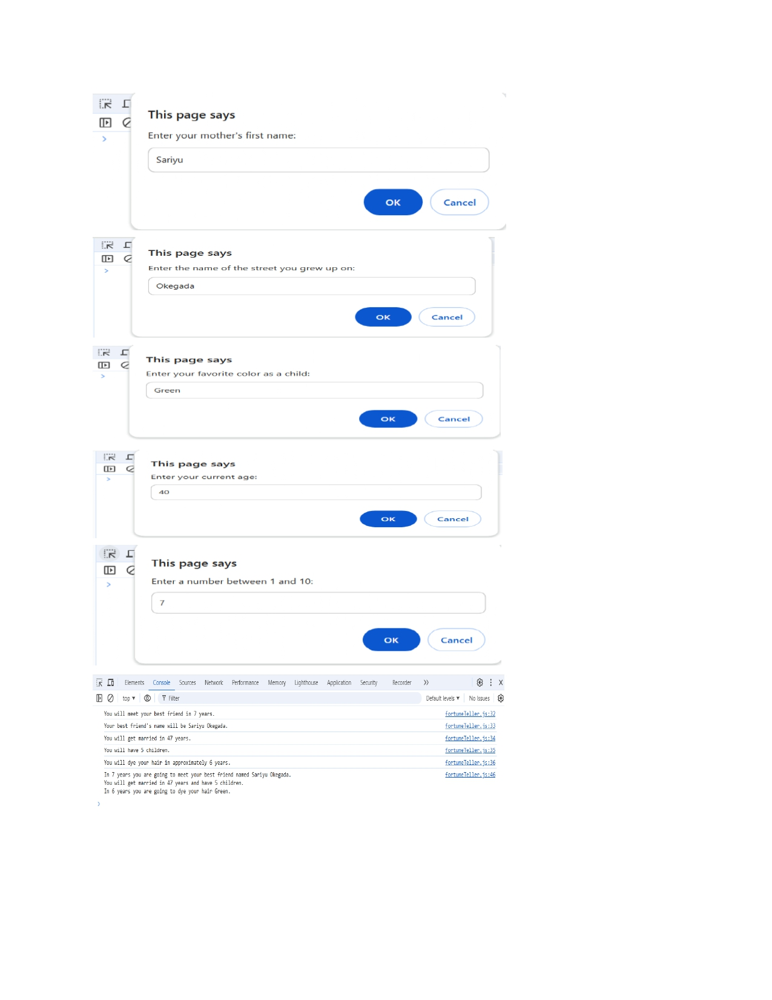

# Fortune Teller App 🎱

Welcome to the **Fortune Teller App**, a fun and interactive project built with HTML and JavaScript. This app asks a few questions to predict your future, including your best friend's name, when you'll get married, the number of children you'll have, and more!

## 🛠 Features
- Predicts when you'll meet your best friend and their name.
- Calculates the age you'll get married.
- Estimates how many children you'll have.
- Predicts when you'll dye your hair your favorite childhood color.

## 📂 Project Structure
- **index.html**: The main HTML file that loads the app.
- **fortuneTeller.js**: The JavaScript file containing the app logic.

## 🚀 How to Use
1. Open the app in your browser.
2. Answer the prompts for:
   - Your mother's first name.
   - The street you grew up on.
   - Your favorite childhood color.
   - Your current age.
   - A number between 1 and 10.
3. Check the console to reveal your fortune!

## 🧑‍💻 Technologies Used
- HTML5
- JavaScript (ES6+)

## 🌟 Key Highlights
- Utilizes modern JavaScript features like template literals and `Math.round`.
- Engages users with personalized fortune predictions.
- Beginner-friendly project to showcase JavaScript fundamentals.

## 📸 Preview

## 🤝 Contributing
Feel free to fork this project, submit issues, or create pull requests. Contributions are welcome!

## 📜 License
This project is licensed under the MIT License.

---
Start predicting your fortune today! ✨
